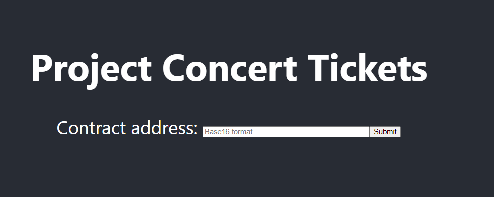
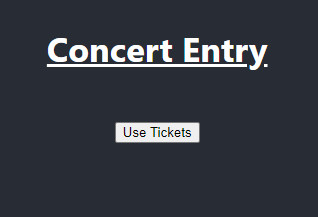

## Zilliqa

# Concert Tickets - Web Application

Step 1: Connect the ZilPay wallet to the web application

Step 2: Inputting Contract Address
Once you have connected your ZilPay wallet, the web page should look like this,

Here, you are prompted to key in your Base16 contract address that is deployed.

# Purchase a ticket yourself using your ZilPay wallet and check the “Concert Entry” section. This section displays a button for ticket holders to use all the tickets that they have to be granted entry into the concert. 

